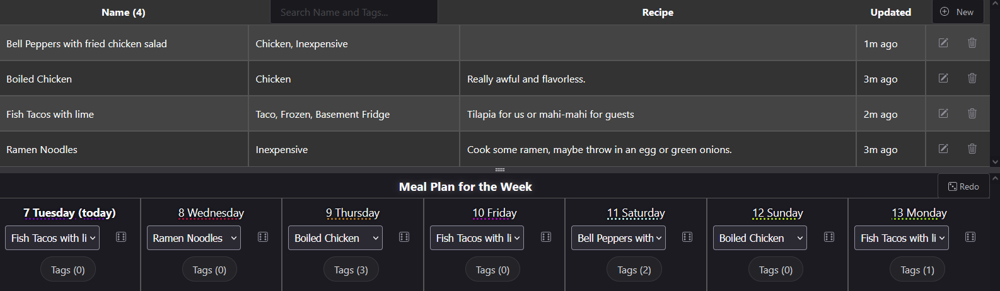

# Snappy Cook
Recipe storage app plus weekly meal planner, with customizable tags and parameters.

The idea is to gather a bunch of recipes - either typing them in manually or pasting HTML from random blogs and websites. This will be a bit of front loaded effort depending on your existing recipe book. Specify your own custom tags (like: Chicken, Taco, Inexpensive, Frozen, Basement Fridge) for each recipe. Then you can set a similar set of tag requirements on each day of the week and the app will randomly assign matching recipes to those days. You can override or re-roll a day manually if you want.

Works well on mobile too!

## Setup
The app uses:
- [Alpine.js](https://alpinejs.dev/) for easier model binding
- [Shoelace.style](https://shoelace.style/) components
- [Trix](https://trix-editor.org/) HTML editor
- [json-server](https://www.npmjs.com/package/json-server) backing
- Otherwise plain vanilla HTML and JS

To start just run `go.sh` which launches json-server to point at the db.json file (or do the equivalent for your own OS and local setup).

Then you can visit http://localhost:3000/ to see the app.
